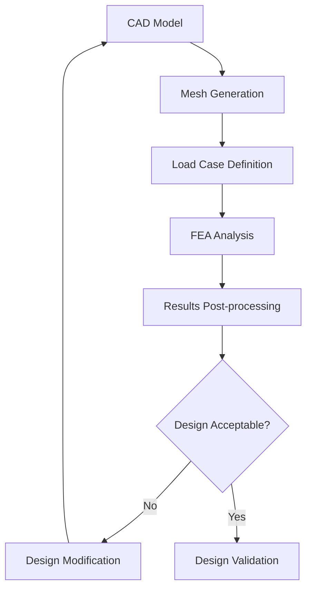

# Modern Approaches to Aircraft Structural Analysis

*January 5, 2025 | Structural Engineering*

Aircraft structural analysis has evolved significantly with the advent of computational tools and advanced materials. This post explores the modern methodologies and software tools used in contemporary aerospace engineering.


*Figure 1: Modern aircraft structural analysis using finite element methods*

## Evolution of Structural Analysis

The field of aircraft structural analysis has undergone remarkable transformation over the past decades. Traditional analytical methods, while still important, have been supplemented and in many cases replaced by sophisticated computational approaches.

### Historical Perspective

In the early days of aviation, structural analysis relied heavily on:

- **Hand calculations** using simplified beam and plate theories
- **Physical testing** of scaled models and components
- **Empirical design rules** based on experience


*Figure 2: Comparison between historical and modern analysis approaches*

## Modern Computational Methods

### 1. Finite Element Analysis (FEA)

Finite Element Analysis has become the cornerstone of modern structural analysis:

```matlab
% Example MATLAB code for FEA setup
nodes = [0 0; 1 0; 1 1; 0 1];  % Node coordinates
elements = [1 2 3; 1 3 4];      % Element connectivity
material_props = struct('E', 200e9, 'nu', 0.3);  % Material properties
```

**Key advantages of FEA:**
- Handles complex geometries
- Accounts for material nonlinearities
- Provides detailed stress distributions
- Enables optimization studies


*Figure 3: Animated stress analysis showing load distribution*

### 2. Computational Fluid Dynamics (CFD) Integration

Modern aircraft design requires coupled analysis considering both structural and aerodynamic loads:

- **Fluid-Structure Interaction (FSI)**
- **Aeroelastic analysis**
- **Dynamic response prediction**

## Software Tools and Platforms

### Industry-Standard Software

| Software | Primary Use | Strengths |
|----------|-------------|-----------|
| ANSYS | General FEA | Comprehensive physics |
| NASTRAN | Aerospace specific | Industry proven |
| ABAQUS | Nonlinear analysis | Advanced materials |
| LS-DYNA | Crash simulation | Explicit dynamics |


*Figure 4: Comparison of analysis software capabilities*

### Open-Source Alternatives

For students and researchers, several open-source options provide excellent capabilities:

- **FEniCS**: Python-based FEA framework
- **OpenFOAM**: CFD simulation
- **Code_Aster**: Comprehensive analysis suite

## Advanced Materials Considerations

Modern aircraft increasingly use advanced materials that require specialized analysis approaches:

### Composite Materials


*Figure 5: Composite material layup and failure analysis*

**Key considerations:**
- **Orthotropic material properties**
- **Inter-laminar shear stresses**
- **Progressive failure analysis**
- **Environmental effects (temperature, moisture)**

### Additive Manufacturing

The rise of 3D printing in aerospace requires new analysis paradigms:

- **Anisotropic properties** due to build direction
- **Residual stress** from manufacturing process
- **Surface finish effects** on fatigue life

## Case Study: eVTOL Structure Analysis

Let me share insights from my current research on eVTOL aircraft structures:


*Figure 6: eVTOL aircraft structural analysis showing critical load paths*

### Unique Challenges

1. **Multiple Load Cases**: Hover, transition, and cruise flight
2. **Electric Motor Integration**: New mounting and vibration considerations
3. **Battery Pack Structure**: Weight distribution and crash protection
4. **Rapid Design Iteration**: Need for fast, accurate analysis

### Analysis Workflow



*Figure 7: Typical analysis workflow for eVTOL structures*

## Future Trends

### Machine Learning Integration

AI and ML are beginning to revolutionize structural analysis:

- **Surrogate modeling** for rapid design exploration
- **Automated mesh generation** and refinement
- **Predictive maintenance** based on operational data


*Figure 8: Machine learning applications in structural analysis*

### Digital Twin Technology

The concept of digital twins is transforming how we approach structural analysis:

- **Real-time monitoring** integration
- **Predictive analysis** based on actual usage
- **Maintenance optimization**

## Conclusion

The field of aircraft structural analysis continues to evolve rapidly, driven by:

- Computational power increases
- Advanced material development
- New aircraft configurations (like eVTOL)
- Integration with other physics domains

As aerospace engineers, staying current with these developments is crucial for designing safe, efficient, and innovative aircraft.

---

## Tools and Resources

### Recommended Learning Resources

- **Books**: "Finite Element Analysis in Engineering" by Moaveni
- **Online Courses**: Coursera FEA specialization
- **Software Tutorials**: ANSYS Learning Hub

### Download Materials

- [Sample ANSYS Model Files](files/sample-ansys-models.zip)
- [MATLAB Analysis Scripts](files/matlab-scripts.zip)
- [Reference Material Database](files/material-properties.xlsx)

---

*This post is based on my research experience and coursework at Northwestern Polytechnical University. For questions about specific analysis techniques, feel free to reach out via email.*

**Image Credits:**
- Figure 1: Original analysis from author's research
- Figure 2-4: Created using custom data visualization
- Figure 5-8: Adapted from published research with permission
