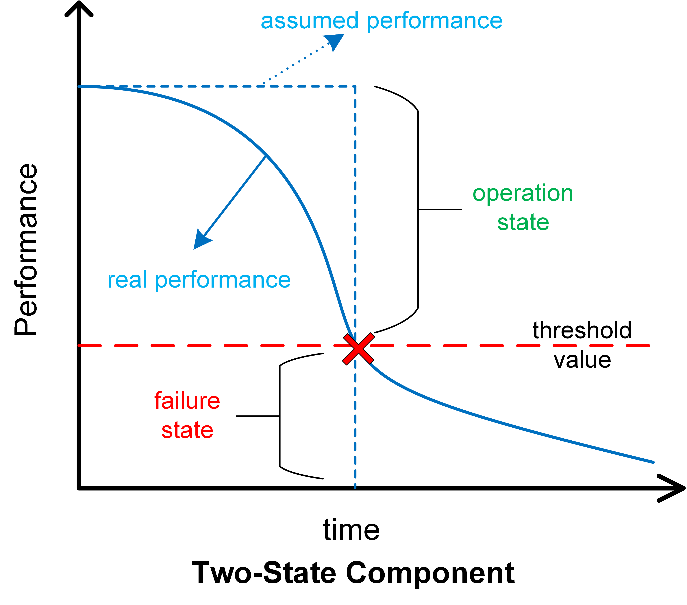

# MultiState System Reliability Assessment
## Background

传统可靠性评估方法在用于解决复杂系统可靠性评估与设计问题时存在许多局限性。传统可靠性理论中，系统只有“完全失效”和“正常工作”两种状态，即系统为被假设为二态系统。显然，这样的假设对于复杂系统而言过于简单，不能真实地反映实际情况。
复杂系统往往不仅具有“正常工作”和“完全失效”两种状态，在两者之间往往还有很多种工作（或失效）状态。大型飞机、高分辨率对地观测系统和载人飞船这些复杂系统在工作过程中 就呈现出结构复杂、多状态的特点。如高分辨率对地观测系统 卫星部件的失效会造成系统性能的降低 以及系统完成任务能力的降低 而不是整个系统的失效或任务的失败。如果利用传统可靠性分析方法对其分析 很难对系统的多状态进行定义 进而难以准确地描述系统性能降低或失效的内在原因。

回顾可靠性的概念：
>可靠性：产品在规定条件下和规定时间内，完成规定功能的能力。

根据这个概念，可以这样理解，系统可靠性和系统性能是密切相关的。当系统性能足以完成任务时，系统可靠，反之则不可靠。而系统性能是和部件性能直接关联的。部件性能的降低会导致系统性能的降低，进而导致系统可靠性的降低，故部件性能是分析系统可靠性的前提。

**更严格地，我们可以建立如下关系**：
- **部件可靠性**：$R_C(t) = P(P_C(t) \geq P_C^T)$ —— 部件性能在时刻$t$超过阈值的概率
- **系统可靠性**：$R_S(t) = P(P_S(t) \geq P_S^T)$ —— 系统性能在时刻$t$超过阈值的概率  
- **性能关联性**：$P_S(t) = f(P_{C_1}(t), P_{C_2}(t), ..., P_{C_n}(t))$

这种描述方式明确了三个关键要素：**性能的时变性**、**阈值的存在性**、**可靠性的概率本质**。

基于二元状态的部件可靠性及系统可靠性分析方法并不能体现出部件性能与系统性能的关系，也不能体现出系统可靠性与系统性能的关系。归根结底，是因为没有引入“性能”的概念，而是采用“一刀切”的方式。

如下图所示，如果部件$C$只有一个性能（后面还会提到多性能），当性能$P_C$在可接受阈值$P_{C}^T$之上，认为仍处于工作状态（1），当性能下降到可接受阈值$P_{C}^T$之下，认为其处于失效状态（0），也就是二态。这对单部件的系统$S$而言，似乎是没问题的，因为此时部件$C$就是整个系统$S$，部件$C$失效，则整个系统$S$失效。

现在考虑一个双部件系统$S$，其由两个部件$C_1,C_2$组成，系统性能$P_S = f(P_{C_1},P_{C_2})$，这里我们并不知道函数$f(·)$是什么。**这正是多状态系统可靠性分析面临的核心挑战**：

1. **部件性能聚合的不确定性**：不同部件的性能如何组合形成系统性能？是简单的线性叠加、最小值约束，还是更复杂的非线性关系？，这需要结合具体系统进行分析。

2. **系统阈值定义的复杂性**：对于单部件系统，我们可以事先定义好性能阈值$P_C^T$，阈值之上工作，之下失效。但对于多部件组成的系统而言，如果仅仅沿用二态思维，我们将面临一个根本问题：**系统的性能阈值$P_S^T$应该如何确定？**

3. **状态空间的指数增长**：更进一步，我们将看到部件不止有一个性能指标，且具有不同的失效模式。此时，传统的二态假设将完全失效，系统的状态空间将呈指数级增长。

## 

